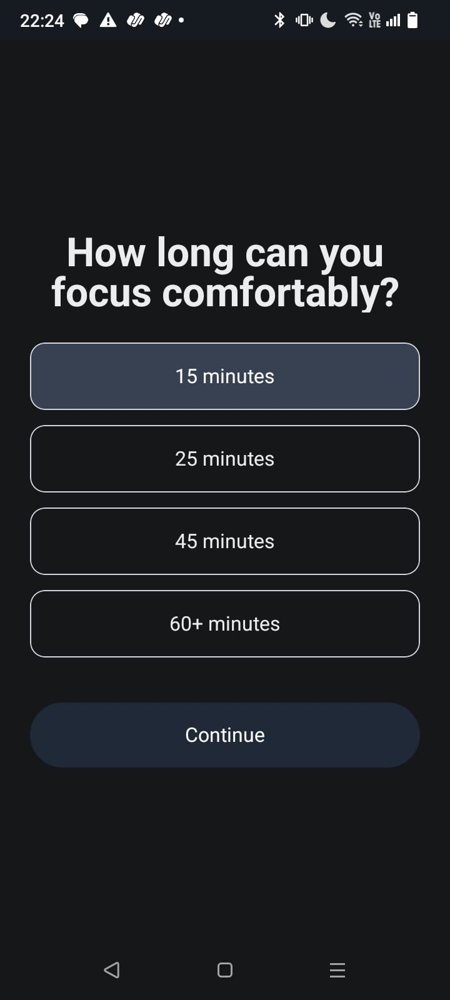
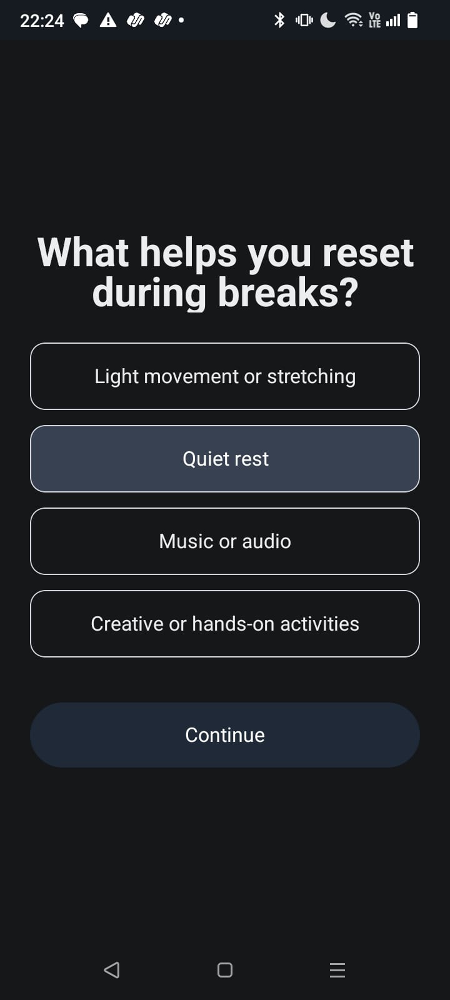
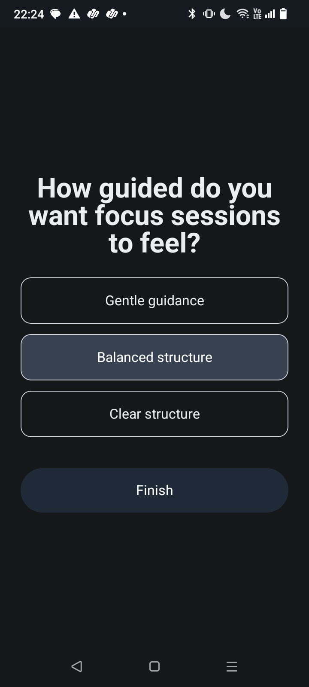
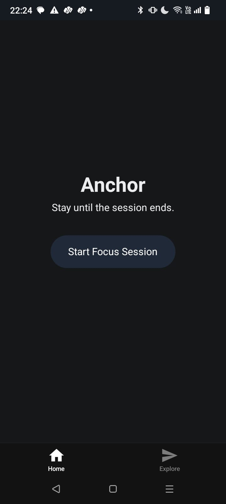
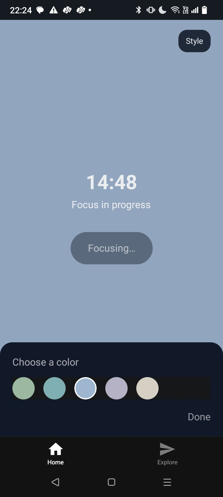
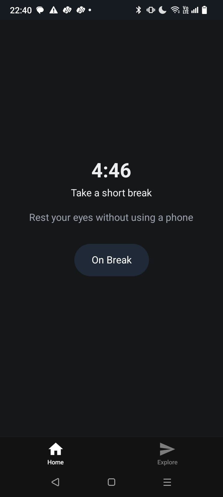

# 🚀 Anchor – Personalized Pomodoro Productivity App

Anchor is a modern productivity application built using React Native and Expo that enhances the traditional Pomodoro technique through personalization and adaptive focus sessions.

---

## ✨ Features

- ⏱️ Customizable focus duration (15 / 25 / 45 / 60 minutes)
- 🎯 Personalized onboarding experience
- 🧠 Adaptive break suggestions based on user preference
- 🔄 Automatic focus → break → cycle transitions
- 🎨 Focus mode UI customization (color themes)
- 📱 Clean and minimal distraction-free interface

---

## 🛠️ Tech Stack

- React Native
- Expo Router
- AsyncStorage
- TypeScript

---

## 📱 Application Flow

1. User completes onboarding  
2. Preferences are stored locally  
3. Focus session begins  
4. Timer counts down  
5. Break session starts automatically  
6. Personalized suggestions are displayed  

---

##  Screenshots

<p align="center">
  
  
  
</p>

<p align="center">
  
  
  
</p>


---

## ⚙️ Installation & Setup

```bash
npm install
npx expo start